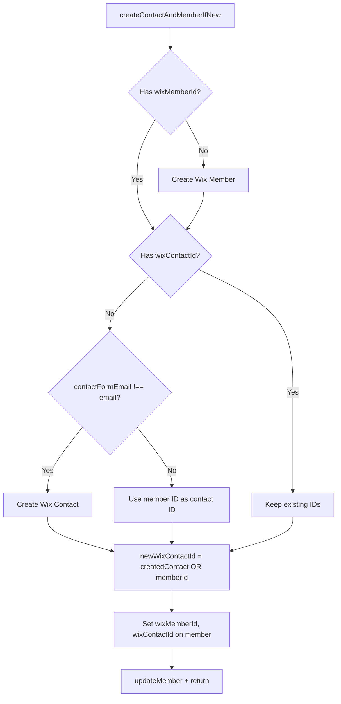
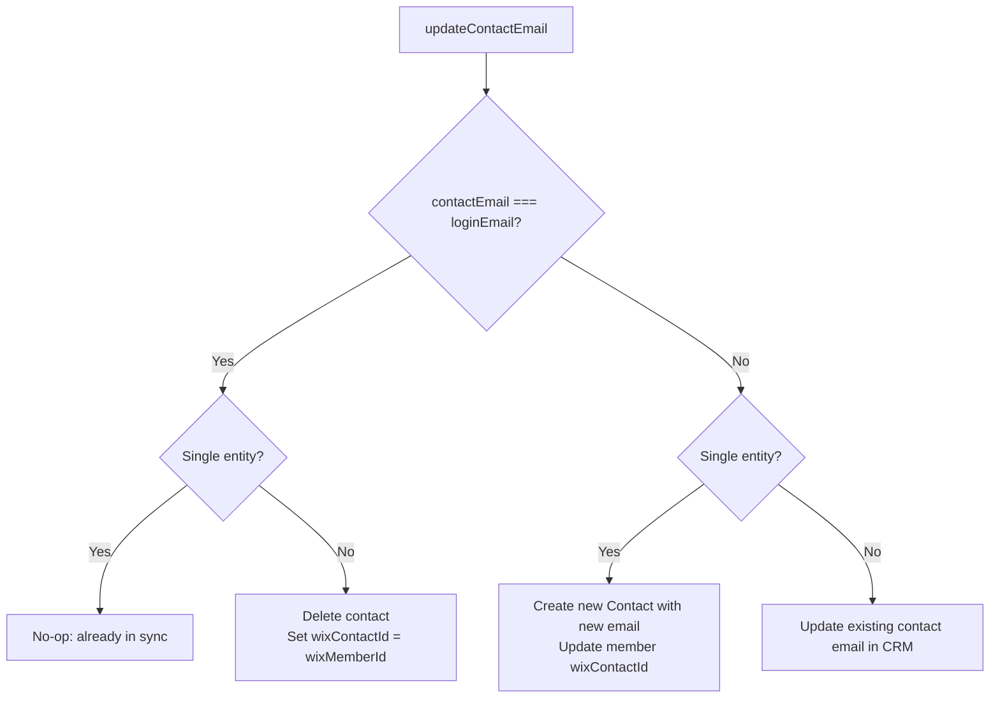

# Member–Contact Flows

How Wix **Members** (login identity) and **CRM Contacts** (form/submission identity) stay in sync in ABMP.

## Concepts

| Concept                | Meaning                                                                                                    |
| ---------------------- | ---------------------------------------------------------------------------------------------------------- |
| **Single entity**      | Member and contact use the same Wix ID (`wixContactId === wixMemberId`). One person, one record.           |
| **Separate contact**   | Member has a login email; contact has a different “form” email. Two Wix entities: one Member, one Contact. |
| **Login email**        | `memberData.email` — used to sign in (Wix Member).                                                         |
| **Contact form email** | `memberData.contactFormEmail` — email used on forms; can differ from login.                                |

---

## 1. Login / first-time flow: `createContactAndMemberIfNew`

**Used when:** A user logs in or is created and we need to ensure they have both a Wix Member and (if needed) a CRM Contact.

**File:** `members-data-methods.js` → `createContactAndMemberIfNew(memberData)`

### Logic in short

- If no **Wix Member** → create one (login identity).
- If no **Wix Contact** and contact form email **differs** from login email → create a separate Contact.
- If contact form email **equals** login email → no separate contact; we use the member ID as the contact ID (single entity).
- Persist `wixMemberId` and `wixContactId` on the member record.

### Flow diagram



### Parallel work

```
                    ┌─────────────────────────────────────┐
                    │  createContactAndMemberIfNew         │
                    └─────────────────────────────────────┘
                                        │
                    ┌───────────────────┴───────────────────┐
                    │           Promise.all([              │
                    │  runIf(needsWixMember, createMember),  │
                    │  runIf(needsContact && differentEmail, │
                    │        createContact)                 │
                    │           ])                          │
                    └───────────────────┬───────────────────┘
                                        │
          newWixContactId = createdWixContactId || newWixMemberId
          (if no separate contact, member ID is the contact ID)
                                        │
                    ┌───────────────────┴───────────────────┐
                    │  updateMember({ ...memberData,        │
                    │    wixMemberId, wixContactId })      │
                    └───────────────────────────────────────┘
```

### Outcome

| Scenario                                | wixMemberId   | wixContactId                        |
| --------------------------------------- | ------------- | ----------------------------------- |
| New user, same email for login and form | New member ID | Same as wixMemberId (single entity) |
| New user, form email ≠ login email      | New member ID | New contact ID (separate contact)   |
| Existing user (already has both IDs)    | Unchanged     | Unchanged                           |

---

## 2. Update contact email flow: `updateContactEmail`

**Used when:** User changes their contact/form email in the app and we need to update CRM and optionally the member record.

**File:** `member-contact-orchestration.js` → `updateContactEmail(newContactEmail, existingMemberData)` (used by `updateMemberContactInfo`).

### Logic in short

- **Single entity** (`wixContactId === wixMemberId`):
  - If new email **equals** login → no change.
  - If new email **differs** → create a new Contact with the new email and point the member to it (we now have a separate contact).
- **Separate contact** (different IDs):
  - If new email **equals** login → delete the extra contact and set `wixContactId = wixMemberId` (collapse to single entity).
  - If new email **differs** → update the existing contact’s email in CRM.

### Flow diagram



### Decision table

| Single entity? | New email vs login | Action                                                            |
| -------------- | ------------------ | ----------------------------------------------------------------- |
| Yes            | Same               | No-op                                                             |
| Yes            | Different          | Create new Contact; set member’s `wixContactId` to new contact ID |
| No             | Same               | Delete Contact; set member’s `wixContactId = wixMemberId`         |
| No             | Different          | Update existing Contact’s email in CRM (no member change)         |

### Where it’s used

`updateContactEmail` is called from `updateMemberContactInfo` when the **contactFormEmail** field changes (e.g. profile or form update). So:

- **Login flow** → `createContactAndMemberIfNew` (ensure member + contact exist and IDs stored).
- **Profile/form email change** → `updateMemberContactInfo` → `updateContactEmail` (keep contact and member in sync).

---

## File roles

| File                              | Role                                                                                                                                |
| --------------------------------- | ----------------------------------------------------------------------------------------------------------------------------------- |
| `contacts-methods.js`             | Contact CRUD only: create/update/delete contact in Wix CRM.                                                                         |
| `member-contact-orchestration.js` | Orchestration: when to create/update/delete contact and when to update member’s `wixContactId`. Uses injected `updateMember`.       |
| `members-data-methods.js`         | Member CRUD, `createContactAndMemberIfNew`; requires `updateMemberContactInfo` and calls `updateMember` once with its return value. |

Dependency direction: **members-data** → **member-contact-orchestration** → **contacts** (no cycle).
